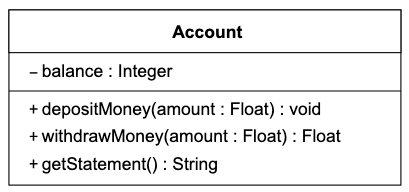

# Bank 💵
This is my submission in response to the bank tech test, as part of the Makers Academy bootcamp. It provides the business logic for a basic banking app, which has been built using JavaScript.

I started the process by writing user stories based off of the given brief, which then influenced how I put together my class diagram to solve the problem.

## User Stories
    As a customer,
    So that I can spend my money,
    I'd like to be able to withdraw from my bank account.

    As a customer,
    So that I can keep my money safe,
    I'd like to deposit money into my account.
    
    As a customer,
    So that I don't accrue debt,
    I'd like to be warned when I try to withdraw more money than I have.

    As a customer,
    So I can manage my finances,
    I'd like to see my transaction history in a statement.

## Class Diagram

    	
___
# Original Brief

Today, you'll practice doing a tech test.

For most tech tests, you'll essentially have unlimited time.  This practice session is about producing the best code you can when there is a minimal time pressure.

You'll get to practice your OO design and TDD skills.

You'll work alone, and you'll also review your own code so you can practice reflecting on and improving your own work.

## Specification

### Requirements

* You should be able to interact with your code via a REPL like IRB or the JavaScript console.  (You don't need to implement a command line interface that takes input from STDIN.)
* Deposits, withdrawal.
* Account statement (date, amount, balance) printing.
* Data can be kept in memory (it doesn't need to be stored to a database or anything).

### Acceptance criteria

**Given** a client makes a deposit of 1000 on 10-01-2012  
**And** a deposit of 2000 on 13-01-2012  
**And** a withdrawal of 500 on 14-01-2012  
**When** she prints her bank statement  
**Then** she would see

```
date || credit || debit || balance
14/01/2012 || || 500.00 || 2500.00
13/01/2012 || 2000.00 || || 3000.00
10/01/2012 || 1000.00 || || 1000.00
```
